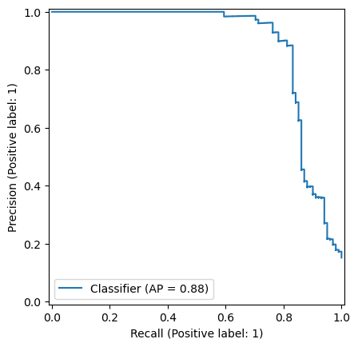
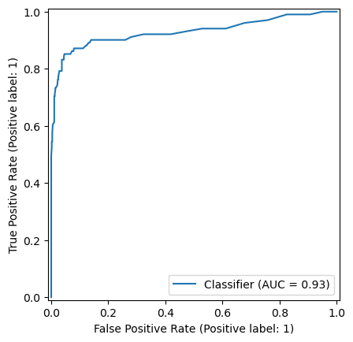
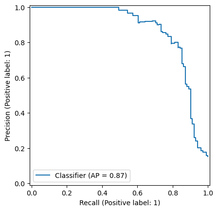

# SyriaTel Customer Churn Prediction

## Description
[This repository contains a machine learning project aimed at predicting customer churn for a telecommunications company called SyriaTel. The project is based on the [Kaggle dataset](https://www.kaggle.com/becksddf/churn-in-telecoms-dataset) and uses a variety of classification algorithms to predict customer churn. ]

## Table of Contents

- [Project Overview](#project-overview)
- [Business Understanding](#business-understanding)
- [Data Understanding](#data-understanding)
- [Data Preparation](#data-preparation)
- [Modeling](#modeling)
- [Evaluation](#evaluation)
- [Results](#results)
- [Usage](#usage)
- [Dependencies](#dependencies)

# Project Overview
Customer Churn is a major concern for businesses as it can lead to a significant loss in revenue. In this project, we aim to predict customer churn for a telecommunications company called SyriaTel. The goal is to help the company proactively address churn and improve customer retention.

# Business Understanding
The objective of this project is to predict customer churn for SyriaTel. By identifying customers who are likely to churn, the company can take proactive measures to retain them. This can help reduce customer attrition and improve customer satisfaction.

# Data Understanding
The dataset contains information about SyriaTel customers, including their account length, international plan, voicemail plan, number of voicemail messages, total day minutes, total day calls, total day charge, total eve minutes, total eve calls, total eve charge, total night minutes, total night calls, total night charge, total intl minutes, total intl calls, total intl charge, customer service calls, and churn status.

# Data Preparation
The data preparation steps include:
- Handling missing values
- Encoding categorical variables
- Normalizing numerical features
- Balancing the dataset using SMOTE(Synthetic Minority Over-sampling Technique)

# Modeling
Three models were built and evaluated:
- Baseline Model: Logistic Regression
- Alternative Model: Random Forest
- Ensemble Model: Gradient Boosting 

# Evaluation
The models were evaluated based on the following metrics:
- Accuracy
- Precision
- Recall
- F1 Score
- ROC AUC Score
- Precision-Recall AP Score

# Results
Gradient Boosting Model
- Accuracy: 0.96
- Precision: 0.89
- Recall: 0.82
- F1 Score: 0.85
- AUC Score: 0.94 
- AP: 0.88

Random Forest Model(Alternative Model)
- Accuracy: 0.94
- Precision: 0.82
- Recall: 0.79
- F1 Score: 0.80
- AUC Score: 0.94 
- AP Score: 0.87 

# Usage
To run this project locally
1. Clone the repository 

2. Install the required dependencies

3. Run the Jupyter notebook

4. Open the notebook and run the cells to reproduce the results

# Dependencies
- Python 3.8+

- Pandas

- Numpy

- Scikit-learn

- Matplotlib

- Seaborn

- Imbalanced-learn

- XGBoost

- Jupyter Notebook

